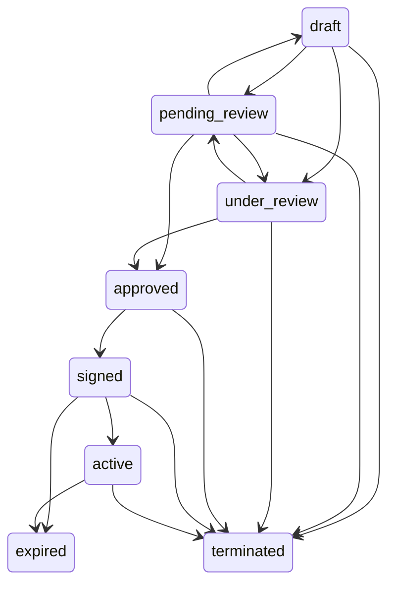

# TASK-05 Contract/E-sign — PRD Coverage

| Requirement | Current Coverage | Evidence | Status |
|---|---|---|---|
| Legal transition matrix | `LEGAL_TRANSITIONS` covers every `ContractStatus` enum member | `tests/test_contract_state_machine.py::test_transition_matrix_covers_all_contract_statuses` | Closed for P0-1 |
| Illegal transition rejection | terminal/backward/shortcut transitions raise `IllegalStateTransition` and preserve original status | 6 illegal cases in `tests/test_contract_state_machine.py` | Closed for P0-1 |
| Review flow uses lifecycle gateway | review start moves draft to `under_review`; review completion moves to `pending_review` | `tests/test_contract_review_workflow.py` plus full backend regression | Closed for P0-1 |
| Manual API transition | authenticated org-scoped route calls `ContractService.transition_status` | API tests cover legal, illegal, and unknown status paths | Closed for P0-1 |
| E-sign flow entry | draft/unapproved contracts cannot create a signing flow and later fail at webhook time | `tests/test_contract_state_machine.py::test_esign_flow_rejects_contract_before_approval` | Closed for P0-1 |
| E-sign webhook writeback | signed/terminated writeback calls the state machine before mutating status | `tests/test_webhook_business_events.py` and `tests/test_external_surface_guards.py -k esign` | Closed for P0-1; official provider protocols still open |
| Version diff and rollback | `ContractVersion` ledger, paragraph diff, rollback API, and front-end version timeline are implemented; rollback is blocked from terminal/legal states by the lifecycle gateway | `tests/test_contract_versions.py`, `tests/test_contract_version_migration.py`, `frontend/e2e/contract-lifecycle.spec.ts` | Closed for P0-4 |
| Review concurrency and timeout | `ContractReviewLock` blocks duplicate review jobs per contract/version; review execution has a 90s default timeout and records retryable `review_failed` | `tests/test_contract_review_workflow.py` | Closed for P0-5 |
| Webhook duplicate concurrency | verified webhooks are serialized by `webhook_processing_lock` before durable idempotency + business writeback | `tests/test_webhook_business_events.py::test_verified_webhook_serializes_concurrent_duplicate_business_writeback` | Closed for P0-5 |
| Contract attachment lifecycle | `ContractAttachment` stores object metadata; upload/list/download/download-url/delete are org-scoped, validated, audited, and backed by `object_storage_service` | `tests/test_contract_attachments.py`, `tests/test_contract_attachment_migration.py` | Closed for P0-6 |
| Official e-sign providers | mock/default and webhook verification have guardrails; full provider APIs remain incomplete | TASK-05 P0-2/P0-3 | Open |

## Lifecycle Matrix

