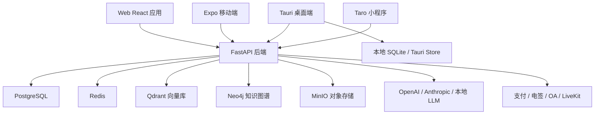

# 架构与模块

## 总体架构

项目采用多端客户端 + FastAPI 后端 + 多种基础设施的架构。

## Web 前端

`frontend/src/App.tsx` 中的路由显示 Web 端已经拆成三类体验：

- 用户端：`/chat`、`/case-center`、`/management`、`/documents`、`/find-lawyer`、`/knowledge-base` 等
- 服务方端：`/pro/*`，面向律师/律所
- 后台管理：`/admin/*`

重要前端基础设施：

- `ProtectedRoute`：认证与 feature 权限守卫
- `AdminRoute`：后台权限守卫
- `ModeGate`：本地/混合/云端模式门控
- `SubscriptionGate`：订阅引导
- `getTokenStorage`：浏览器/桌面端 token 存储抽象
- `api.ts` / `api-adapter.ts`：云端 API 与本地/桌面适配层

## 后端

后端采用 FastAPI route + service + model 分层。典型模块包括：

- `auth.py`：注册、登录、刷新 token、OAuth、找回密码
- `contracts.py` / `contract_service.py`：合同创建、审查、状态、版本、附件、下载
- `documents.py` / `document_service.py`：文档上传、分析、版本、对象存储
- `knowledge.py` / `knowledge_service.py`：知识库、RAG、权限边界
- `billing.py` / `subscription_service.py` / `payment_service.py`：订阅、支付、退款
- `esign.py` / `esign_service.py`：电子签署流程
- `im.py` / `im_service.py`：即时通讯与 WebSocket
- `sync.py` / `sync_service.py`：同步底座

## 桌面端

桌面端位于 `desktop/`，基于 Tauri 2.x：

- 复用 `frontend/dist`
- 提供系统托盘、全局快捷键、通知、文件、SQL、Store、Updater、深链等能力
- Rust IPC 暴露应用模式、同步、CLI、本地 LLM、离线任务和认证命令

桌面端当前最大的架构风险是同步职责边界：Rust 侧和前端 Tauri bridge 都出现过同步实现/占位实现，需要统一。

## 移动端

移动端位于 `mobile/`，基于 Expo Router：

- 登录、注册、忘记密码
- 首页收件箱
- AI 聊天
- 任务、审批、消息、通知
- 案件、合同、找律师
- 智能调查和法律智库入口

移动端是独立 App，不是 WebView；但功能深度明显低于 Web。

## 微信小程序

小程序位于 `mini-program/`，基于 Taro：

- 首页
- AI 聊天
- 个人中心

当前更像轻量入口版。首页多个快捷入口尚未接通真实页面。

