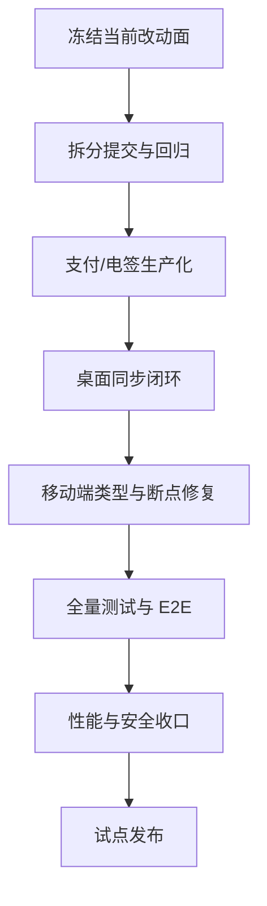

# 上线风险与收口路线

## 当前最大风险

| 风险 | 严重度 | 说明 |
|---|---|---|
| 支付生产默认 mock | 高 | 未知 provider 回退 mock，生产应 fail-closed |
| 电子签真实证据不足 | 高 | e签宝/法大大代码级适配已推进，但仍需要真实沙箱、回调和下载/撤销证据 |
| 桌面同步未闭环 | 高 | Rust IPC、本地 SQLite、前端 bridge 职责需统一 |
| 移动端类型检查失败 | 中高 | 移动端不可作为发布候选 |
| 前端 token / legacy storage 迁移 | 中高 | 已有改进，但安全回归必须完整跑 |
| Web bundle 偏大 | 中 | 影响首屏性能和生产体验 |
| 小程序功能覆盖浅 | 中 | 不能按完整移动端交付宣传 |

## 发布前必须完成

### P0

- 支付 provider 生产环境禁止默认 mock 和未知渠道回退。
- 电子签 provider 完成真实渠道对接或在产品中明确关闭入口。
- 全量后端 pytest、前端 lint/build/test/e2e 重新跑并记录证据。
- 移动端 `tsc --noEmit` 修复。
- 桌面同步路径明确唯一实现，避免“看起来同步成功但实际未落地”。
- 当前未提交改动拆批提交，避免一次性发布过大的不可审查变更。

### P1

- 修复 `lottie-web` eval 或明确 CSP 风险接受策略。
- 优化大 chunk 分包。
- 补移动端智能调查、知识库搜索、微信登录。
- 桌面端签名、公证、自动更新 pubkey 和安装包验收。
- 小程序补齐真实功能入口或隐藏未开放入口。

### P2

- 接入文档站工具，例如 VitePress 或 MkDocs。
- 为关键 API 补契约测试，替代当前不可用的 shape_check。
- 建立发布证据目录，沉淀每次验收日志。

## 推荐收口顺序

## 最终发布判断

可以进入试点发布的条件：

- Web 主线 E2E 通过
- 后端全量 pytest 通过
- 支付/电签入口要么真实可用，要么产品上明确关闭
- 桌面端不展示未闭环同步成功态
- 移动端没有类型检查失败
- 密钥、token、webhook、匿名聊天等安全遗留有明确处理或风险接受记录

如果以上条件不满足，应继续标记为 beta / preview，而不是正式 1.0。
