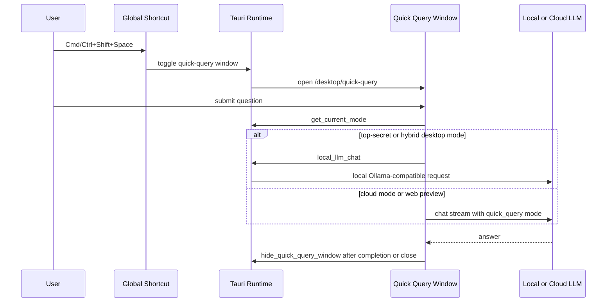

# Desktop Quick Query Flow

Status: code-level complete, packaged runtime evidence pending.

## Scope

The desktop quick query path gives the workstation a Spotlight-style legal assistant without disturbing the main workspace.



## Local Contract

- Shortcut label: `quick-query`.
- Route: `/desktop/quick-query`.
- Window: 420 x 540, undecorated, non-resizable, always on top, skipped from taskbar.
- Local-mode behavior: `top-secret` and `hybrid` desktop modes prefer `local_llm_chat` with a concise legal system prompt.
- Cloud/web behavior: `cloud` mode and non-Tauri previews use the existing chat API stream/fallback path.
- Hide behavior: close button, `Esc`, window blur, or successful answer auto-hide call `hide_quick_query_window`.

## Verification

```bash
cd desktop && cargo test quick_query
cd frontend && npm test -- quickQueryModel.test.ts
cd frontend && npx playwright test e2e/quick-query.spec.ts --project=chromium
```

## Still Pending

- Packaged Tauri runtime smoke proving the global shortcut opens the real packaged window.
- Sub-200ms shortcut-to-visible measurement on macOS and Windows.
- Real local model manual smoke with Ollama or a compatible local model endpoint.
- Signed/notarized package evidence.
